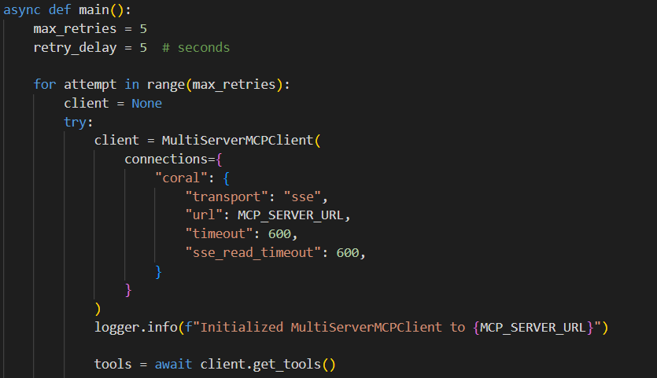

# Coral Agent Build Guide

## Introduction

### AI Agent

An AI agent within any given framework ([LangChain](https://github.com/langchain-ai/langchain), [Camel](https://github.com/camel-ai/camel), [CrewAi](https://github.com/crewAIInc/crewAI)) can be conceptualised as comprising three core components: model, prompts, and tools. Together, these components enable the AI agent to perceive, reason, and act within a framework, with the model processing data, prompts directing its focus, and tools facilitating real-world interactions.

- **Model:** The model serves as the computational core, typically a machine learning system like a large language model or reinforcement learning algorithm, processing inputs to generate decisions or outputs. 

- **Prompts:** Prompts act as the guiding interface, providing structured instructions or queries that shape the model’s behavior to align with specific goals, such as answering questions or executing tasks.

- **Tools:** Tools extend the agent’s capabilities by enabling interaction with the external environment, such as fetching data via APIs, controlling hardware, or performing specialized computations.

### MCP & Frameworks

After the launch of [Model Context Protocol (MCP)](https://github.com/modelcontextprotocol), most AI frameworks have adopted a client-based approach, enabling AI agents, acting as clients, to easily connect to a suite of powerful tools provided by the MCP server. These tools include standardised APIs that allow agents to interface with external systems, such as databases or web services, for seamless data retrieval and task execution specific to AI operations.

An AI agent determines which tools it can use through a discovery mechanism provided by the MCP server, typically involving a tool registry or metadata service that lists available tools, their functionalities, and access protocols, enabling the agent to select appropriate tools based on its task requirements and compatibility.

### Coralised Agent

A Coralised Agent is an AI agent developed within any given framework and configured to connect as a client to the [Coral Server](https://github.com/Coral-Protocol/coral-server), which is a MCP server. This connection enables the agent to access a robust set of tools provided by the Coral Server, enhancing its capabilities beyond those of its original framework. In addition to these server-provided tools, the Coralised Agent retains its native tools from its original framework, allowing it to combine the Coral Server’s advanced capabilities with its inherent functionalities.

## How to build a Coralised Agent?

To develop a custom Coralised Agent that connects to the Coral Server as a client, follow these steps to ensure proper integration, collaboration, and functionality. Below example shows how you can coralise a [LangChain AI Agent](https://github.com/Coral-Protocol/Coral-Interface-Agent)

<details>

<summary>Connecting the Agent to the Coral Server</summary>

   - Configure the agent to connect to the Coral Server using the `MultiServerMCPClient` from the `langchain_mcp_adapters.client` module.  
   - Set the server URL by retrieving `CORAL_SSE_URL` from the environment variables, appending query parameters like `agentId` (e.g., `CORAL_AGENT_ID`) and `agentDescription` to identify the agent.  
   - Use a Server-Sent Events (SSE) transport mechanism with appropriate timeout settings (e.g., `timeout=600`, `sse_read_timeout=600`) to establish a persistent connection.  
   - Implement retry logic to handle connection failures, such as `ClosedResourceError`, with a maximum retry limit (e.g., 5 attempts) and delay (e.g., 5 seconds) to ensure robust connectivity.  
   - Verify the connection by logging the initialization of `MultiServerMCPClient` and checking for successful tool retrieval from the server.

   

</details>  

<details>

<summary>Updating the Model</summary>

   - Select a suitable model for the agent, such as `ChatOpenAI` with a specific version (e.g., `gpt-4.1-2025-04-14`) or an alternative like `ChatGroq`, ensuring compatibility with the Coral Server’s requirements.  
   - Configure model parameters (e.g., `temperature=0.3`, `max_tokens=32768`) to balance creativity and output length for the agent’s tasks.  
   - Ensure the model is initialized with the correct API key (e.g., `OPENAI_API_KEY` from environment variables) to authenticate requests.  
   - Update the model as needed to incorporate advancements or fine-tuning, ensuring it supports tool-calling and collaboration features required by the Coral Server.  
   - Test the model’s integration with the agent framework (e.g., LangChain’s `create_tool_calling_agent`) to confirm it processes inputs and tools correctly.

</details>  

<details>

<summary>Checking the Prompt for Collaboration with Coral Server Tools</summary>

   - Design the prompt using `ChatPromptTemplate` to include explicit instructions for collaboration, such as listing connected agents (`list_agents`), creating threads (`create_thread`), adding participants (`add_participant`), sending messages (`send_message`), and waiting for responses (`wait_for_mentions`).  
   - Ensure the prompt outlines a clear workflow: start by listing agents, waiting for responses, etc select relevant agents based on their descriptions, and manage multi-agent interactions through threads with non-empty `mentions`.  
   - Include a tools description in the prompt (e.g., using `get_tools_description`) to inform the model of available Coral Server tools, and its own tools (if any) ensuring it knows how to use them for collaboration.  
   - Prevent the agent from prematurely ending the interaction by including instructions like “You MUST NEVER finish the chain” and looping back to ask the user for further input after each task.  
   - Validate that the prompt supports dynamic interaction with Coral Server tools, allowing the agent to adapt to varying user requests and agent responses.

</details>  

<details>

<summary>Ensuring Agent Tools and Coral Server Tools Are Passed to the Agent</summary>


   - Retrieve Coral Server tools dynamically using `client.get_tools()` from the `MultiServerMCPClient` to access server-provided tools like APIs, data exchange modules, or task orchestration utilities.  
   - Append native agent tools, such as the `ask_human` tool (defined with a coroutine like `ask_human_tool` for user interaction), to the list of Coral Server tools. In your case the tools can differ, you must ensure your custom tools are passed.
   - Pass the combined toolset to the agent during initialization via `create_tool_calling_agent`, ensuring the agent can access both native and server-provided tools.  
   - Verify tool integration by logging the tools description (e.g., using `get_tools_description`) to confirm that all tools, their names, and schemas are correctly passed to the agent.  
   - Ensure the agent can select tools via the Coral Server’s discovery mechanism (e.g., tool registry or metadata service), which provides details on tool functionalities and access protocols.

</details>  

<details> 

<summary>Adding an Environment File for Connections and API Keys</summary>

   - Create a `.env` file to store critical configuration details, such as `CORAL_SSE_URL` for the Coral Server connection (e.g., `http://localhost:5555/devmode/exampleApplication/privkey/session1/sse` for local mode or a Docker-specific URL).  
   - Include `CORAL_AGENT_ID` to uniquely identify the agent (e.g., `user_interaction_agent`) and `OPENAI_API_KEY` for model authentication.  
   - Use the `dotenv` library to load environment variables via `load_dotenv()` at the start of the program, ensuring secure and flexible configuration.  
   - Validate that all required environment variables are accessible during runtime, logging errors if any are missing and test connectivity in both local and Docker environments.

</details>  

## What is Coraliser?

Coraliser streamlines the adoption of Coral by automating the conversion of both MCP servers and standalone agents into Coral-compatible agents. Once integrated, these agents can seamlessly receive inputs from the Coral Server and invoke their tools as needed. This makes your multi-agent system more efficient, scalable, and ready for production use without additional configuration.

Coraliser is a powerful tool that streamlines the integration of both MCP servers and standalone agents with the Coral Server. It automates the generation of Coral-compatible agents, eliminating the need for manual wiring or complex configurations.

Coraliser currently includes the following components:

- **mcp-coraliser**: Run coraliser.py with a `coraliser_settings.json` file that includes connection details for multiple MCP servers. The Coraliser attempts to connect to each MCP adaptor listed and automatically generates Coral-compatible agents for the ones that are reachable. If a connection fails for any MCP adaptor, it flags the issue and proceeds to the next available MCP, ensuring uninterrupted agent generation for all valid connections.

- **agent-coraliser**: By providing an input agent in `.py` format and executing `coraliser.py`, Coraliser first validates whether the file contains a valid agent using a Language model. If it does, it generates a Coral-compatible version of that agent, ready to run within the Coral Server.

The key difference between the MCP Coraliser and the Agent Coraliser lies in their scope. The MCP Coraliser creates Coralised agents by connecting to available MCP servers using adaptors—which are essentially connection commands defined in the json. Once connected, it reads all available tools from the MCP server and create coralised agents. These Coralised agents can then process prompts and execute actions using the connected MCP tools, all within the same Coral Server. 

In contrast, the Agent Coraliser works by analyzing a given Python file to determine whether it defines a valid agent. If the file does not represent a compatible agent, it flags the issue. If it is valid, the Agent Coraliser generates a Coralised version of the agent, making it compatible with the Coral Protocol and ready to interact within the Coral ecosystem.

## Get Started for mcp-coraliser

### 1. Clone & Install Dependencies
<details>

```bash
# Clone the Repository
git clone https://github.com/Coral-Protocol/Coraliser.git

# Navigate to the Project Directory
cd Coraliser

# Install uv
pip install uv

# Sync dependencies from pyproject.toml
uv sync
```
</details>

### 2. Configure Environment Variables
<details>

```bash
# Create .env file in project root
cp -r .env_sample .env
```
</details> 

### 3. Setting Up and Running the MCP-Coraliser
<details>

1. **Update `coraliser_settings.json`**:  
   Provide the connection details for your MCP server(s).

2. **Run the MCP Coraliser**:

```bash
   uv run utils/langchain/mcp-coraliser/coraliser.py
```

This script validates connections and generates Coral-compatible agent scripts.

4. **Review the Generated Agents**:  
   Check files like `firecrawl_coral_agent.py`, `github_coral_agent.py` to confirm they are configured correctly.

5. **Run the Agents** (assuming your Coral Server is running):

```bash
   uv run firecrawl_coral_agent.py
```

```bash
   uv run github_coral_agent.py
```
</details> 

## Get Started for agent-coraliser

### 1. Clone & Install Dependencies
<details>

```bash
# Clone the Repository
git clone https://github.com/Coral-Protocol/Coraliser.git

# Navigate to the Project Directory
cd Coraliser

# Install uv
pip install uv

# Sync dependencies from pyproject.toml
uv sync
```
</details>

### 2. Configure Environment Variables
<details>

```bash
# Create .env file in project root
cp -r .env_sample .env
```
</details> 

### 3. Setting Up and Running the Agent-Coraliser
<details>

1. **Prepare the Input Agent**:  
   Ensure you have a valid agent Python file (e.g., `agent_coraliser_sample_input.py`).

2. **Run the Agent Coraliser**:

```bash
   uv run utils/langchain/agent-coraliser/coraliser.py
```

   (You’ll be prompted to enter the agent file name (including `.py` extension).)

3. **Review the Generated Agent File**:  
   Confirm the generated script matches your expectations.

4. **Run the Agent**:

```bash
uv run <generated_filename>.py
```
</details>

## License

This project is licensed under the MIT License.

```
MIT License

Copyright (c) 2025 Coral Protocol

Permission is hereby granted, free of charge, to any person obtaining a copy
of this software and associated documentation files (the "Software"), to deal
in the Software without restriction, including without limitation the rights
to use, copy, modify, merge, publish, distribute, sublicense, and/or sell
copies of the Software, and to permit persons to whom the Software is
furnished to do so, subject to the following conditions:

The above copyright notice and this permission notice shall be included in all
copies or substantial portions of the Software.

THE SOFTWARE IS PROVIDED "AS IS", WITHOUT WARRANTY OF ANY KIND, EXPRESS OR
IMPLIED, INCLUDING BUT NOT LIMITED TO THE WARRANTIES OF MERCHANTABILITY,
FITNESS FOR A PARTICULAR PURPOSE AND NONINFRINGEMENT. IN NO EVENT SHALL THE
AUTHORS OR COPYRIGHT HOLDERS BE LIABLE FOR ANY CLAIM, DAMAGES OR OTHER
LIABILITY, WHETHER IN AN ACTION OF CONTRACT, TORT OR OTHERWISE, ARISING FROM,
OUT OF OR IN CONNECTION WITH THE SOFTWARE OR THE USE OR OTHER DEALINGS IN THE
SOFTWARE.
```

For more information, visit:  
https://www.coralprotocol.org/
